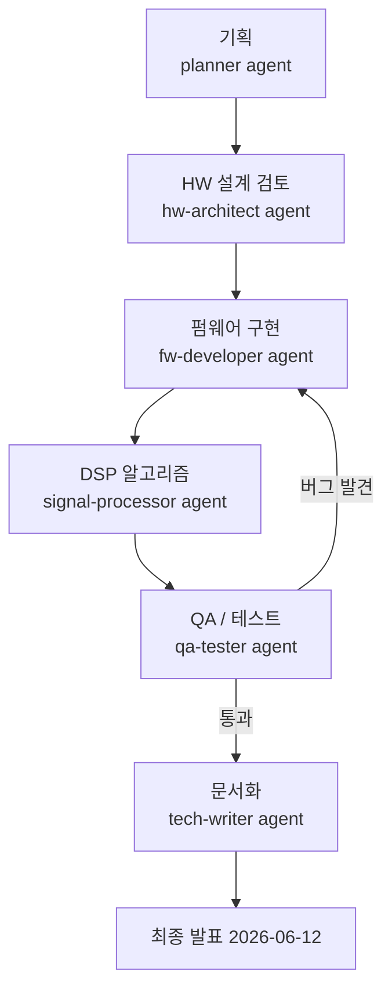
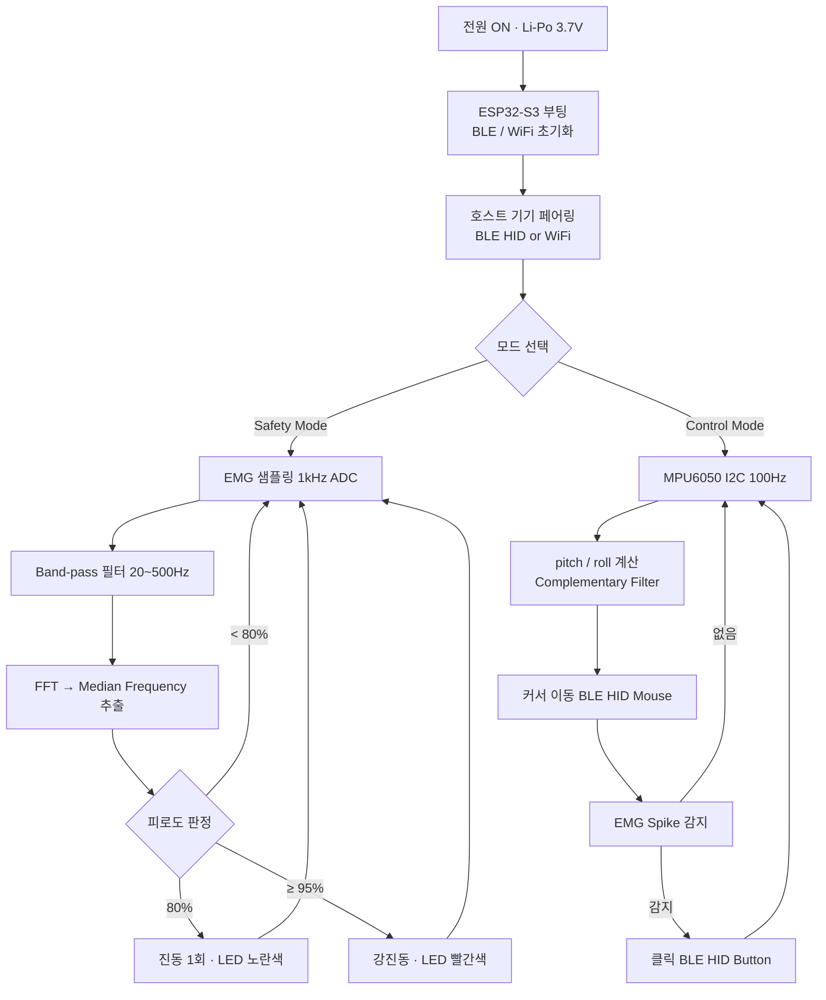

# CLAUDE.md

This file provides guidance to Claude Code (claude.ai/code) when working with code in this repository.

## Project Overview

**BBB (Bio Body Band)** — EMG + IMU 센서를 결합한 웨어러블 아대. 두 가지 동작 모드:
- **Safety Mode**: 실시간 근피로도 모니터링 → 진동 경보 (80%/95% 임계치)
- **Control Mode**: 팔 기울기(IMU)로 커서 이동, 주먹 쥐기(EMG spike)로 클릭 — BLE HID Mouse

## 개발 프로세스 플로우



## 아대 동작 흐름도



## Hardware Platform

| 부품 | 모델 | 비고 |
|------|------|------|
| MCU | Seeed XIAO ESP32-S3 | BLE HID + WiFi + USB-C 충전 내장 |
| EMG | MyoWare 2.0 | 아날로그 출력 → ADC |
| IMU | MPU6050 | I2C, 6-axis |
| 배터리 | 3.7V Li-Po 300mAh+ | USB-C 충전 |
| 피드백 | 코인 진동모터 | GPIO PWM |
| 디스플레이 | 0.96" OLED (선택) | I2C |

## H/W 제약 규칙

- **경량화 최우선**: 모든 설계 결정에서 무게·부피를 최소화. 불필요한 부품 추가 금지.
- **통신**: BLE HID 또는 WiFi 소켓만 허용. USB/유선 연결로 HID 구현 금지.
- **전원**: 3.7V Li-Po, 2시간 이상 연속 동작 보장. 절전 모드(Light Sleep) 적극 활용.
- **사용자 피드백**: 진동모터는 필수. LED·OLED는 선택이나 추가 시 전류 예산 확인.
- **센서 추가 시**: I2C 버스 주소 충돌 및 전류 소비 증가 검토 필수.
- **하우징**: FDM 3D 프린팅(PLA/PETG) 기준 설계. 피부 접촉면 소재 주의.

## S/W 코딩 규칙

**언어**: MicroPython (ESP32-S3 펌웨어), CPython 3.11+ (PC 툴링·테스트)

**스타일**
- PEP 8 준수, 줄 길이 최대 **88자** (`black` formatter 기준)
- 모든 public 함수·클래스에 **type hints** 필수
- docstring: **Google style** (`Args:`, `Returns:`, `Raises:`)

**모듈 구조** (기능별 단일 책임)
```
firmware/
├── sensor/     # EMG, IMU 드라이버
├── algo/       # 필터, FFT, 피로도 판정
├── comm/       # BLE HID, WiFi
└── ui/         # 진동모터, LED, OLED
tools/          # PC용 데이터 수집·분석 스크립트
tests/          # pytest 단위·통합 테스트
```

**테스트**
- `pytest` 사용, 커버리지 목표 80%+
- 실제 시리얼 포트 통신 테스트 우선; mock은 외부 의존성에만 사용
- 구현 전 테스트 케이스 먼저 작성 (검증 기준 선정 후 코딩)

**커밋 메시지**: Conventional Commits
- `feat:` 새 기능, `fix:` 버그, `test:` 테스트, `docs:` 문서, `hw:` 하드웨어 설계 변경

**검증 명령**
```bash
python -m pytest tests/ -v          # 단위 테스트
python -m pytest tests/ --cov       # 커버리지 포함
black --check firmware/ tools/      # 포맷 검사
```

## Agents & Skills

**Agents** (`.claude/agents/`):
- `planner` — 기획·스펙 작성
- `hw-architect` — HW 설계 검토
- `fw-developer` — 펌웨어 구현
- `signal-processor` — DSP/ML 알고리즘
- `qa-tester` — 테스트·검증
- `tech-writer` — 문서화

**Skills** (슬래시 명령):
- `/plan-feature <기능명>` — 기능 정의 → SPEC 문서 생성
- `/implement <스펙파일>` — 스펙 → 코드 → 테스트 구현
- `/run-qa` — 테스트 실행 → 버그 리포트

## 자주 사용되는 경로 & 모듈명

**문서**
- `docs/flow.md` — 전체 진행 상태 체크리스트 (진행 시 overwrite)
- `docs/history/YYYY-MM-DD-*.md` — 주요 결정·변경 사항 기록
- `docs/specs/` — 기능 스펙 정의서

**펌웨어 모듈** (생성 시 참고)
- `firmware.sensor.emg` — MyoWare 2.0 ADC 드라이버
- `firmware.sensor.imu` — MPU6050 I2C 드라이버
- `firmware.algo.filter` — Band-pass / Complementary 필터
- `firmware.algo.dsp` — FFT, Median Frequency
- `firmware.comm.wifi` — WiFi UDP 송신
- `firmware.ui.motor` — GPIO PWM 진동모터 제어
- `firmware.ui.led` — RGB LED (선택사항)

**PC 도구 모듈** (생성 시 참고)
- `tools.receiver` — WiFi UDP 수신 서버
- `tools.algo.fatigue` — 피로도 판정 로직
- `tools.algo.cursor` — IMU → 커서 이동 변환
- `tools.hid_controller` — BLE HID 명령 발신

## 히스토리 관리

모든 작업 진행 내용은 `docs/history/` 하위 마크다운 파일로 기록한다.

**파일 명명**: `YYYY-MM-DD-<topic>.md`
예: `2026-04-02-bom.md`, `2026-04-10-safety-mode-spec.md`

**기록 대상**: BOM 결정, 기능 스펙 정의·변경, 알고리즘 설계 결정, 테스트 결과, H/W 변경(핀맵·회로)

**형식**:
```markdown
# <작업 제목>
**날짜**: YYYY-MM-DD
**작업자**: <Agent / Human>
**관련 파일**:

## 요약
## 결정 사항
## 변경된 파일
## 다음 단계
```

새 작업 완료 시 반드시 히스토리 파일을 생성하거나 업데이트한다.

## 개발 Flow 관리

`docs/flow.md` 는 전체 개발 아이템의 진행 현황을 나타내는 **단일 파일**이다. 날짜별 히스토리와 별개로, "어디까지 했는가"를 체크리스트 형태로 보여준다.

**규칙**:
- 작업 완료 시 해당 항목에 `[x]` 와 날짜 태그 추가: `` - [x] `YYYY-MM-DD` 항목명 ``
- 새 작업 항목이 생기면 `[ ]` 로 추가
- 이 파일은 **덮어쓰기(overwrite)** 방식으로 최신 상태를 유지
- `docs/history/*.md` 는 세부 기록, `docs/flow.md` 는 전체 흐름 체크리스트로 역할 분리

## 현재 상태 (As of 2026-04-03)

**완료됨:**
- 프로젝트 기획 및 시나리오 정의
- HW BOM 및 회로 설계 결정
- 발표 자료 준비

**구현 예정:**
- `firmware/` — ESP32-S3 MicroPython 코드 (센서 드라이버, 통신, UI 제어)
- `tools/` — PC Python 도구 (WiFi 수신, DSP 알고리즘, HID 제어)
- `tests/` — pytest 테스트 스위트

현재 코드는 `docs/` (기획·스펙)과 `.claude/` (에이전트·스킬) 내에만 존재함.

## 개발 환경 & 빌드

**PC 환경** (노트북에서 DSP 알고리즘 실행)
```bash
# 의존성 설치
pip install -r requirements.txt          # pytest, numpy, scipy, black, pyautogui

# 테스트 실행
python -m pytest tests/ -v               # 모든 테스트
python -m pytest tests/test_algo.py -v   # 특정 테스트만
python -m pytest tests/ --cov=tools      # 커버리지 포함 (목표 80%+)

# 포맷 검사 & 자동 정렬
black firmware/ tools/ tests/            # 코드 자동 정렬 (88자)
black --check firmware/ tools/           # 검사만 (CI/CD용)
```

**ESP32-S3 펌웨어**
- **플래싱 도구**: `esptool.py` 또는 Thonny IDE
- **MicroPython 버전**: 최신 ESP32-S3 port (https://micropython.org/download/)
- **시리얼 포트 연결**: USB-C (내장 충전 회로)
```bash
# 이 명령들은 사용자가 펌웨어 준비 시 실행 (지금은 Not applicable)
# esptool.py --chip esp32-s3 write_flash -z 0x0 firmware.bin
```

**의존성 파일** (생성 시 추가)
- `requirements.txt` — PC 도구용 Python 패키지
- `requirements_firmware.txt` — MicroPython 라이브러리 (I2C, ADC 드라이버 등)

## 통신 아키텍처

**WiFi UDP** (센서 데이터: ESP32 → 노트북)
- ESP32-S3이 센서 raw 데이터를 UDP 패킷으로 전송
- PC가 수신하여 DSP 알고리즘(FFT, 필터링) 실행
- 지연시간(Latency) 목표: 50ms 이내

**BLE HID** (제어 신호 & 외부 기기 연결)
- PC에서 BLE HID 마우스 명령 발신
- **외부 기기**(Windows/Mac/Linux) HID 호환 장치로 인식
- Control Mode에서 IMU/EMG 기반 커서 이동·클릭

> ℹ️ **중요**: BLE HID는 ESP32-S3이 마우스로 작동하는 것이 아니라, PC가 외부 기기에 BLE 신호를 중계하는 구조

## 테스트 전략

**PC 사이드 (pytest)**
- Unit: 필터, FFT, 피로도 판정 로직 → `tests/test_algo.py`
- Integration: WiFi UDP 수신 및 데이터 처리 → `tests/test_integration.py`
- Mock: 센서 raw 데이터 fixture → `tests/fixtures/`

**하드웨어 테스트** (필요 시 수동 또는 CI)
- 실제 ESP32-S3 + 센서 연결 후 데이터 수신 확인
- UART/WiFi 시리얼 모니터로 debug 메시지 확인
- 진동모터 및 LED 핀 토글 확인

## 일정

| 기간 | 목표 |
|------|------|
| W1–W2 | 부품 수급, ESP32-S3 WiFi UDP 기본 통신 |
| W3–W5 | EMG/IMU 필터링 + 특징점 추출 알고리즘 |
| W6–W8 | BLE HID 마우스 최적화, 3D 하우징 |
| W9–W11 | 통합 테스트, 보정, 사용자 피드백 |
| W12 | 최종 발표 **2026-06-12** |
