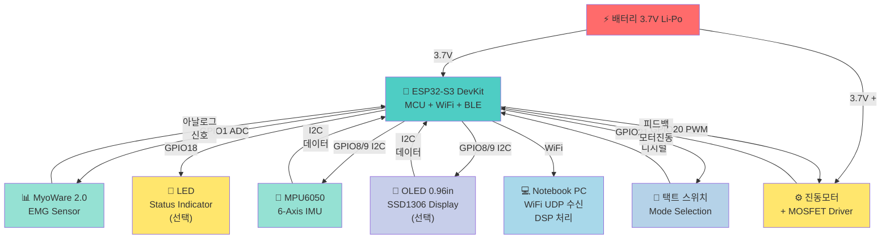

# BBB 전체 연결 회로도

**최종 업데이트**: 2026-05-05  
**기준 보드**: ESP32-S3 DevKit  
**전원**: 배터리 3.7V Li-Po

---

## 전체 시스템 블록 다이어그램



---

## ESP32-S3 DevKit 핀 배치

```
              [ USB-C ]
        GND  [1 ]  [38] 5V
       IO43  [2 ]  [37] IO44   (UART TX/RX)
       IO45  [3 ]  [36] IO0
       IO46  [4 ]  [35] IO48
        IO3  [5 ]  [34] IO47
        IO2  [6 ]  [33] IO21   ← Mode Switch
        IO1  [7 ]  [32] IO20   ← Motor PWM
       IO42  [8 ]  [31] IO19
       IO41  [9 ]  [30] IO18   ← LED
       IO40 [10 ]  [29] IO17
       IO39 [11 ]  [28] IO16
       IO38 [12 ]  [27] IO15
       IO37 [13 ]  [26] IO14
       IO36 [14 ]  [25] IO13
        3V3 [15 ]  [24] IO12
        GND [16 ]  [23] IO11
        IO8 [17 ]  [22] IO10   ← ADC1 (EMG)
        IO9 [18 ]  [21] IO9    ← I2C SCL
```

---

## 전체 배선 연결표

### 전원 배포

| 출처 | 대상 | 용도 | 비고 |
|------|------|------|------|
| 배터리(+) 3.7V | ESP32 BAT/5V | 내부 LDO → 3.3V | 센서·MCU 전원 |
| 배터리(+) 3.7V | 모터(+) | 직접 연결 | MOSFET 회로 |
| 배터리(-) | ESP32 GND | 공통 그라운드 | 기준점 |
| 배터리(-) | MOSFET Source | 공통 그라운드 | 기준점 |
| 3.3V | MyoWare VS+ | 센서 전원 | LDO 출력 |
| 3.3V | MPU6050 VCC | 센서 전원 | LDO 출력 |
| 3.3V | OLED VCC | 센서 전원 | LDO 출력 (선택) |
| GND | 모든 GND | 공통 그라운드 | 멀티 포인트 |

### 신호 연결

| GPIO | 부품 | 신호명 | 타입 |
|------|------|--------|------|
| GPIO1 | MyoWare 2.0 | SIG → ADC | 아날로그 입력 (1kHz) |
| GPIO8 | MPU6050 | SDA | I2C Data (400kHz) |
| GPIO9 | MPU6050 | SCL | I2C Clock (400kHz) |
| GPIO8 | OLED | SDA | I2C Data (공유, 선택) |
| GPIO9 | OLED | SCL | I2C Clock (공유, 선택) |
| GPIO20 | MOSFET | Gate | PWM 출력 (1~5kHz) |
| GPIO18 | LED | Anode | 디지털/PWM |
| GPIO21 | 택트SW | Input | 디지털 입력 (풀업) |

---

## 신호 흐름

### Safety Mode (피로도 모니터링)

```
MyoWare EMG (팔 근육)
         ↓
GPIO1 ADC (1kHz 샘플링)
         ↓
ESP32-S3 (메모리 버퍼)
         ↓
WiFi UDP → 노트북 PC
         ↓
PC 필터/FFT → Median Frequency 추출
         ↓
피로도 판정 (80%/95% 임계치)
         ↓
WiFi 명령 송신 → GPIO20 PWM
         ↓
모터 진동 + LED 색상 변경
```

### Control Mode (커서 제어)

```
MPU6050 IMU (팔 기울기)
         ↓
GPIO8/9 I2C (100Hz)
         ↓
ESP32-S3 (Complementary Filter)
         ↓
WiFi UDP → 노트북 PC
         ↓
PC IMU → pitch/roll → 화면 좌표 변환
         ↓
pyautogui 커서 이동

+

MyoWare EMG (주먹 쥐기)
         ↓
GPIO1 ADC → Spike 감지 (3500 임계값)
         ↓
WiFi 명령 송신 → BLE HID 클릭
```

---

## I2C 버스 구조

```
                ┌─────────────────────────┐
                │  I2C Bus (GPIO8/9)      │
                │  Freq: 400kHz           │
                └──────┬────────┬─────────┘
                       │        │
         ┌─────────────┼─────┐  │
         │             │     │  │
    ┌────────┐    ┌─────────┐│  │
    │MPU6050 │    │ OLED    ││  │
    │I2C 0x68│    │ I2C 0x3C││  │
    └────────┘    └─────────┘│  │
                              │  │
                          GPIO8 GPIO9
                          (SDA) (SCL)
```

---

## 참고 파일

각 부품의 상세 회로도:
- `docs/02_HW/02_motor_circuit.md` — 진동모터 MOSFET 드라이버
- `docs/02_HW/03_led_circuit.md` — LED 상태 표시
- `docs/02_HW/04_switch_circuit.md` — 택트 스위치 모드 전환
- `docs/02_HW/05_emg_circuit.md` — EMG 센서 ADC
- `docs/02_HW/06_imu_circuit.md` — MPU6050 I2C
- `docs/02_HW/07_oled_circuit.md` — OLED 디스플레이 (선택)
- `docs/02_HW/08_power_circuit.md` — 전원 배포 및 배터리

---

## 납땜 시 주의사항

1. **전원 극성**: 배터리 + (빨강) / - (검정) 확인
2. **I2C 풀업**: 4.7kΩ 저항 (모듈에 내장 보통)
3. **MOSFET 방향**: TO-92 1(G), 2(S), 3(D) 순서
4. **다이오드 방향**: 1N4148 띠 방향 = 캐소드(-)
5. **GND 연결**: 모든 GND를 하나로 통합 (Star 배선)

---

## 검증 체크리스트

```
[ ] 배터리 극성 확인
[ ] 모든 점퍼선 도통 테스트 (멀티미터)
[ ] ESP32 부팅 (USB 연결, LED 깜빡임)
[ ] I2C 스캔 (0x68 = MPU6050, 0x3C = OLED)
[ ] ADC 읽기 (GPIO1 = EMG, 500~4095 범위)
[ ] GPIO 출력 (GPIO20 = 모터, GPIO18 = LED)
[ ] GPIO 입력 (GPIO21 = 스위치)
```
