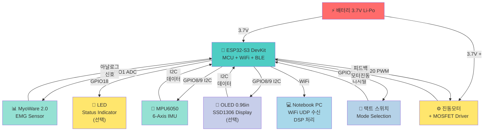

# BBB H/W 핀맵 & 회로도 설계

**날짜**: 2026-05-05  
**작업자**: Claude AI  
**상태**: 설계 완료 (납땜 전 확인 필수)

---

## 1. ESP32-S3 DevKit 핀맵 (선택된 GPIO)

ESP32-S3 DevKit은 38개 GPIO를 제공합니다. BBB 프로젝트에서 사용할 핀:

| 기능 | GPIO | 타입 | 비고 |
|------|------|------|------|
| **EMG 신호** | GPIO1 | ADC1 | MyoWare 2.0 SIG → ADC (1kHz 샘플링) |
| **IMU SDA** | GPIO8 | I2C SDA | MPU6050 데이터 라인 |
| **IMU SCL** | GPIO9 | I2C SCL | MPU6050 클럭 라인 |
| **진동모터** | GPIO20 | PWM | MOSFET Gate (드라이버) |
| **LED** | GPIO18 | GPIO/PWM | 상태 표시 (선택) |
| **모드 스위치** | GPIO21 | GPIO (Input) | Safety/Control 모드 전환 |
| **3.3V 전원** | 3V3 | Power | 센서 전원 |
| **5V 전원** | 5V | Power | 보드 입력 (USB 또는 배터리) |
| **GND** | GND | Ground | 공통 그라운드 |

**특수 핀**:
- GPIO43/44: UART (디버깅용, 선택사항)
- GPIO47: 내장 LED (펌웨어에서 제어 가능, 선택사항)

---

## 2. 전체 블록 다이어그램 (Mermaid)



---

## 3. 부품별 상세 회로도 (Markdown)

### 3.1 진동모터 드라이버 (MOSFET 2N7000)

**목적**: GPIO20의 약한 신호(3.3V, ~20mA)를 배터리 3.7V 강력한 신호로 증폭하여 모터 구동

**부품**:
- 2N7000 MOSFET (TO-92, N-channel)
- 1N4148 다이오드 (Flyback 보호)
- 100Ω 저항 (Gate 보호)
- 배터리 3.7V, 모터 Ø10mm 3V DC

**회로도**:
```
                  배터리 3.7V (+)
                       │
                       ├────────── 모터 (+)
                       │              │
                       │          [1N4148] ← Flyback 다이오드
                       │              │      (역방향 병렬)
                       │          모터 (-)
                       │              │
    GPIO20 ───┬──[100Ω]──────────┬─ Drain(2N7000)
              │                   │
              │           Gate ┐  │
              │           (2N7000)
              └───────────┘   │
                         Source ─── GND (배터리 -)
```

**핀 정의**:
```
2N7000 TO-92 (정면에서)
  1(G) - Gate     → GPIO20 (100Ω 거쳐서)
  2(S) - Source   → GND (배터리 음극)
  3(D) - Drain    → Motor (-) 및 1N4148 애노드(+)

1N4148
  A(+) - Anode    → Motor (-)
  K(-) - Cathode  → Motor (+)
```

**동작 원리**:
1. GPIO20 = HIGH (3.3V) → Gate에 전위차 발생
2. 2N7000 도통 (On) → Drain-Source 간 저항 ↓
3. 배터리 전류 모터로 흐름 → 진동 시작
4. GPIO20 = LOW (0V) → 2N7000 차단 (Off) → 모터 정지
5. 1N4148이 역기전력 보호 (모터 OFF 시 발생하는 스파이크 제거)

**배선 체크리스트**:
- [ ] 2N7000 Gate ← GPIO20 (100Ω 직렬)
- [ ] 2N7000 Source → GND 연결
- [ ] 2N7000 Drain → Motor (-) 연결
- [ ] Motor (+) → 배터리 3.7V 직결
- [ ] 1N4148 애노드(+) → Motor (-)
- [ ] 1N4148 캐소드(-) → Motor (+)

---

### 3.2 LED (상태 표시)

**목적**: 안전 모드/제어 모드, 피로도 수준 시각 피드백

**부품**:
- 5mm LED (적색/노랑/초록 또는 RGB)
- 220Ω 저항 (현제 제한)
- GPIO18

**회로도**:
```
GPIO18 ──[220Ω]──→ LED(+) ──→ LED(-) ──→ GND

또는 RGB LED인 경우:
GPIO18 ──[220Ω]──→ LED R(+)  ──→ LED공통(-) ──→ GND
GPIO17 ──[220Ω]──→ LED G(+)
GPIO16 ──[220Ω]──→ LED B(+)
(공통 캐소드 기준, 공통 애노드면 극성 반대)
```

**값 선택**:
- LED 정격 I: ~20mA
- GPIO 출력: 3.3V
- R = (3.3V - LED_Vf) / I = (3.3 - 2.0) / 0.020 = 65Ω
- 실제 사용: 220Ω (안정적, 밝기 낮음) 또는 100Ω (더 밝음)

**배선 체크리스트**:
- [ ] GPIO18 → 220Ω 직렬
- [ ] LED (+) → 220Ω 거쳐서
- [ ] LED (-) → GND 연결
- [ ] RGB인 경우 공통핀 명확히 (애노드 or 캐소드)

---

### 3.3 택트 스위치 (모드 전환)

**목적**: Safety Mode ↔ Control Mode 전환, 펌웨어 리셋

**부품**:
- 4핀 택트 스위치
- 10kΩ 저항 (풀업, 선택)
- GPIO21

**회로도 (풀업 저항 사용)**:
```
3.3V ──[10kΩ]──┬─→ GPIO21
               │
            [SW]
               │
              GND

풀업 사용 시:
- SW 열림: GPIO21 = HIGH (3.3V)
- SW 닫힘: GPIO21 = LOW (0V)
```

**회로도 (내부 풀업 사용)**:
```
      ┌─→ GPIO21 (INPUT_PULLUP 펌웨어 설정)
    [SW]
      │
     GND

주: ESP32 내부 풀업 사용 가능 → 외부 저항 생략
```

**배선 체크리스트**:
- [ ] 스위치 한쪽 핀 → GPIO21
- [ ] 스위치 다른 쪽 핀 → GND
- [ ] 풀업 저항 (외부): 3.3V ─[10kΩ]─ GPIO21 (선택)
- [ ] 펌웨어에서 `pinMode(GPIO21, INPUT_PULLUP)` 설정

---

### 3.4 EMG 센서 (MyoWare 2.0)

**목적**: 근전도 신호 수집 (1kHz 샘플링)

**부품**:
- MyoWare 2.0 Basic Kit (DEV-21267)
- GPIO1 (ADC1_CH0)

**회로도**:
```
MyoWare 신호 경로:
┌──────────────────────────────┐
│   MyoWare 2.0 센서 모듈      │
│  (전극 + 신호처리 기판)      │
└────────────┬──────────────────┘
      3핀 커넥터
      ├─ SIG (신호) ──[스크린핀]──→ GPIO1 (ADC1_CH0)
      ├─ VS+ (3.3V) ────────────→ 3.3V
      └─ GND (그라운드) ────────→ GND
```

**ADC 설정 (MicroPython)**:
```python
from machine import ADC, Pin

adc = ADC(Pin(1))           # GPIO1 = ADC1_CH0
adc.atten(ADC.ATTN_11DB)    # 0~3.3V 범위
adc.width(ADC.WIDTH_12BIT)  # 12-bit 해상도 (0~4095)

# 샘플 읽기
raw_adc = adc.read()        # 0~4095
voltage_mv = raw_adc * 3300 // 4095  # 0~3300 mV
```

**신호 범위 (일반적)**:
| 상태 | ADC 범위 | mV 범위 | 의미 |
|------|---------|---------|------|
| 정지 | 500~1500 | 400~1200 | 신호 있음 (정상) |
| 약한 수축 | 1500~2500 | 1200~2000 | 가벼운 근육 움직임 |
| 강한 수축 | 2500~4095 | 2000~3300 | 주먹 쥐기 (클릭 트리거 ~3500) |

**배선 체크리스트**:
- [ ] MyoWare SIG → GPIO1 (ADC1)
- [ ] MyoWare VS+ → 3.3V
- [ ] MyoWare GND → GND
- [ ] 스크린핀 연결 (전자기 간섭 감소)
- [ ] **중요**: ADC2(GPIO11~20) 사용 금지 (WiFi와 충돌)

---

### 3.5 IMU 센서 (MPU6050)

**목적**: 6축 관성측정 (가속도 3축, 각속도 3축) → Control Mode 커서 이동

**부품**:
- GY-521 모듈 (MPU6050 + I2C 레귤레이터)
- GPIO8 (SDA), GPIO9 (SCL)
- I2C 버스 공유 (OLED와 동시 연결 가능)

**회로도**:
```
        ┌─────────────────────────┐
        │   MPU6050 (GY-521)      │
        │  6-Axis IMU             │
        └──────┬───────────────────┘
          6핀 커넥터
          ├─ VCC ──────→ 3.3V
          ├─ GND ──────→ GND
          ├─ SDA ──────→ GPIO8 (I2C Data)
          ├─ SCL ──────→ GPIO9 (I2C Clock)
          ├─ XDA ──────→ (미사용, 또는 GND)
          └─ XCL ──────→ (미사용, 또는 GND)

I2C 버스 구조:
              ┌─ GPIO8 (SDA) ────┬─ MPU6050 SDA
              │                  ├─ OLED SDA (선택)
GPIO8 ────────┤
              └─ (풀업저항 4.7kΩ, 모듈에 내장 보통)

              ┌─ GPIO9 (SCL) ────┬─ MPU6050 SCL
              │                  ├─ OLED SCL (선택)
GPIO9 ────────┤
              └─ (풀업저항 4.7kΩ, 모듈에 내장 보통)
```

**I2C 주소**:
- MPU6050: `0x68` (AD0=GND, 기본값)
- OLED SSD1306: `0x3C` (주소 고정)

**배선 체크리스트**:
- [ ] MPU6050 VCC → 3.3V
- [ ] MPU6050 GND → GND
- [ ] MPU6050 SDA → GPIO8 (점퍼선)
- [ ] MPU6050 SCL → GPIO9 (점퍼선)
- [ ] MPU6050 AD0 → GND 연결 (I2C 주소 0x68 고정)
- [ ] I2C 풀업저항 4.7kΩ (모듈에 내장 확인)

**MicroPython I2C 초기화**:
```python
from machine import I2C, Pin

i2c = I2C(0, scl=Pin(9), sda=Pin(8), freq=400000)

# I2C 스캔 (연결 확인)
devices = i2c.scan()
print(devices)  # [0x68, 0x3C] 또는 [104, 60]
```

---

### 3.6 OLED 디스플레이 (선택사항)

**목적**: 실시간 피로도, 모드, 배터리 상태 표시

**부품**:
- 0.96" SSD1306 I2C OLED
- GPIO8 (SDA), GPIO9 (SCL) - MPU6050과 공유

**회로도**:
```
        ┌──────────────────┐
        │  OLED SSD1306    │
        │  0.96" I2C       │
        └────────┬─────────┘
          4핀 커넥터
          ├─ VCC ──────→ 3.3V
          ├─ GND ──────→ GND
          ├─ SDA ──────→ GPIO8 (I2C Data, MPU6050과 공유)
          └─ SCL ──────→ GPIO9 (I2C Clock, MPU6050과 공유)
```

**배선 체크리스트**:
- [ ] OLED VCC → 3.3V
- [ ] OLED GND → GND
- [ ] OLED SDA → GPIO8 (점퍼선, MPU6050 SDA와 병렬)
- [ ] OLED SCL → GPIO9 (점퍼선, MPU6050 SCL와 병렬)

---

### 3.7 전원 버스 (배터리 연결)

**목적**: 모든 부품에 안정적 전원 공급

**부품**:
- 배터리 3.7V Li-Po 500mAh (JST 1.25mm 커넥터)
- ESP32-S3 내장 LDO (3.7V → 3.3V 변환)

**회로도**:
```
배터리 3.7V (+) ─┬─ ESP32 BAT/5V 핀 ──LDO→ 3.3V
                 │  (내부 레귤레이터)     ├─→ 센서전원(3.3V)
                 │                       ├─→ MCU 전원
                 └─ MOSFET 모터(+) 직결
                   (LDO 우회, 3.7V 풀파워)

배터리 3.7V (-) ─┬─ ESP32 GND
                 └─ MOSFET Source
                 
[공통 GND]
```

**전원 분배**:
| 부품 | 전압 | 경로 |
|------|------|------|
| ESP32 MCU | 3.3V | BAT → LDO → 3.3V |
| MyoWare 2.0 | 3.3V | 3.3V 버스 |
| MPU6050 | 3.3V | 3.3V 버스 |
| OLED | 3.3V | 3.3V 버스 |
| 진동모터 | 3.7V | 배터리 직결 (LDO 우회) |

**배선 체크리스트**:
- [ ] 배터리 (+) JST → ESP32 BAT 또는 5V 핀
- [ ] 배터리 (-) JST → ESP32 GND (모든 GND와 연결)
- [ ] 모터 (+) → 배터리 (+) 직결
- [ ] 모터 (-) → MOSFET Drain
- [ ] MOSFET Source → GND (배터리와 공통)
- [ ] **중요**: 극성 확인 (배터리 역상 방지!)

---

## 4. 납땜 순서 (추천)

1. **ESP32-S3 DevKit 준비** (기존 헤더 확인)
   - 좌측: GND, IO43, IO45, IO46, IO3, IO2, IO1, IO42, IO41, IO40, IO39, IO38, IO37, IO36
   - 우측: GND, 5V, IO0, IO48, IO47, IO21, IO20, IO19, IO18, IO17, IO16, IO15, IO14, IO13, IO12, IO11, IO10, IO9, IO8, IO7, IO6, IO5, IO4

2. **점퍼선 준비** (1.25mm² 단선, 색상 구분)
   - 빨강: 3.3V, 5V
   - 검정: GND
   - 파랑/초록: 신호 (GPIO)
   - 노랑: 아날로그 (ADC)

3. **MOSFET 회로 조립** (미니 브레드보드 또는 만능기판)
   - 2N7000 TO-92 핀 구부려서 기판에 고정
   - Gate → 100Ω 저항 → GPIO20 점퍼선
   - Source → GND
   - Drain → 1N4148 애노드

4. **EMG 센서 연결**
   - MyoWare SIG (노랑) → GPIO1
   - MyoWare VS+ (빨강) → 3.3V
   - MyoWare GND (검정) → GND

5. **MPU6050 I2C 연결**
   - VCC (빨강) → 3.3V
   - GND (검정) → GND
   - SDA (파랑) → GPIO8
   - SCL (초록) → GPIO9
   - AD0 → GND (또는 미사용)

6. **LED 연결** (선택)
   - GPIO18 → 220Ω → LED (+)
   - LED (-) → GND

7. **택트 스위치 연결**
   - 한쪽 → GPIO21
   - 다른쪽 → GND

8. **OLED 연결** (선택, MPU6050과 병렬)
   - VCC → 3.3V
   - GND → GND
   - SDA → GPIO8 (MPU6050 SDA와 같은 선)
   - SCL → GPIO9 (MPU6050 SCL과 같은 선)

9. **배터리 JST 연결** (맨 마지막)
   - 배터리 (+) → ESP32 BAT/5V
   - 배터리 (-) → ESP32 GND
   - **극성 확인 후 연결!**

---

## 5. 납땜 전 검사 체크리스트

```
[ ] ESP32-S3 DevKit 핀 확인 (GPIO 라벨 명확)
[ ] 모든 부품 핀 배치 확인 (보드 뒷면 라벨 읽음)
[ ] 점퍼선 색상 구분 (3.3V 빨강, GND 검정, GPIO 파랑 등)
[ ] MOSFET 방향 확인 (TO-92: 1=G, 2=S, 3=D)
[ ] 다이오드 방향 확인 (1N4148: 띠 방향 = 캐소드)
[ ] 저항값 확인 (100Ω MOSFET, 220Ω LED)
[ ] 배터리 극성 확인 (+ 빨강, - 검정)
[ ] 모든 배선 최종 체크 (도통 검사)
```

---

## 6. 납땜 후 검증

### 6.1 전원 확인 (배터리 연결 전)

```bash
# 멀티미터로 확인
- 배터리 (+) ─ LED (-): 3.7V 출력
- ESP32 3.3V ─ GND: 0V (개방회로 상태)
```

### 6.2 배터리 연결 및 부팅

```bash
# ESP32-S3 DevKit USB 연결
1. Thonny IDE 열기
2. Tools → Options → Interpreter → MicroPython (ESP32) 선택
3. LED 깜빡임 확인 → 부팅 성공
```

### 6.3 각 센서 개별 테스트

```python
# Thonny REPL에서 실행

# 1. EMG 테스트
from emg import EMGSensor
emg = EMGSensor(adc_pin=1)
print(emg.read_raw())  # 500~4095 범위 출력?

# 2. I2C 스캔
from machine import I2C, Pin
i2c = I2C(0, scl=Pin(9), sda=Pin(8))
print(i2c.scan())  # [104, 60] 또는 [0x68, 0x3C] 출력?

# 3. LED 점멸
from machine import Pin, PWM
led = Pin(18, Pin.OUT)
led.on()
led.off()

# 4. 모터 테스트
motor = PWM(Pin(20), freq=1000)
motor.duty(512)  # 50% PWM
# 모터가 진동?

# 5. 스위치 입력
sw = Pin(21, Pin.IN, Pin.PULL_UP)
print(sw.value())  # 누르면 0, 놓으면 1?
```

---

## 7. 관련 파일 및 참고 문서

- `firmware/sensor/emg.py` — EMG 드라이버
- `firmware/sensor/emg_quick_test.py` — Thonny 테스트 스크립트
- `firmware/sensor/imu.py` — IMU 드라이버 (후속)
- `firmware/ui/motor.py` — 진동모터 제어
- `firmware/ui/led.py` — LED 제어
- `docs/02_HW/bom.md` — 전체 BOM 목록

---

## 커밋 메시지

```
docs: add BBB H/W pinmap and circuit diagrams

- Add comprehensive pinmap for ESP32-S3 DevKit
- Document motor driver (MOSFET 2N7000) circuit
- Include LED, switch, EMG, IMU, OLED circuits
- Add power distribution and soldering order
- Add verification checklist
```
